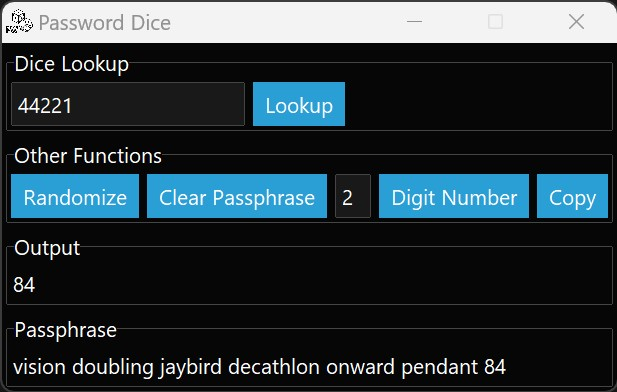

# Introduction

This project is a little bit of a Python script which assists users into using EFF.org's Dice-Generated Passphrases. As a result, wordlist.txt is subject to the licensing EFF assigns to their long-wordlist at the time of pushing it.

The wordlist file itself is created by the EFF (Electronic Frontier Foundation).

# Instructions

Run the "main" script or application (if using binary release) from the directory where you cloned or extracted it.

If you have and want to use physical dice, roll the dice, and enter the order of the numbered sides into the lookup box, and click the Lookup button next to it. The application will then look up that sequence against the wordlist.

Otherwise you can use the Randomize button to randomly select a word.

Clear Passphrase button - clears the passphrase box

Digit Number button - generates a random number with the set number of digits in the box before it, also adds it to the passphrase box

Copy - copies the contents of the passphrase box so you can paste it elsewhere.



# Custom Wordlists

As this script just looks into the "wordlist.txt" file, you are free to put in your own wordlists as long as the follow the same general format:

```
[number or dice sequence]   word
```

# Inner workings

The first thing the script does is use SQL Alchemy to create a memory database, and then imports into the memory database all of the line items into said database. This creates a searchable index.

The random function actually uses this database instead, with a random order SQL function, to make sure that custom wordlists can be utilized (4 dice wordlists for instance).